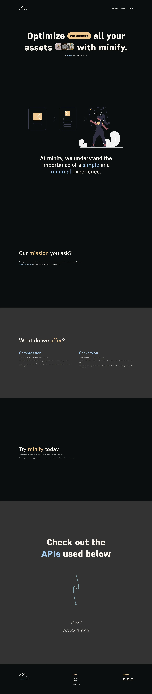
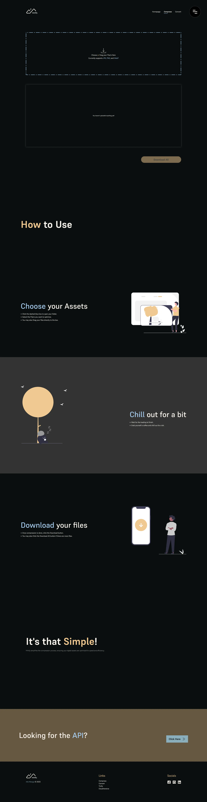
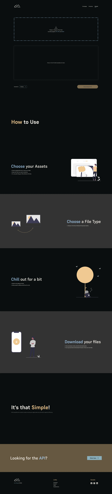

# OptiMG

OptiMG is a personal project which offers both image compression and image format conversion using both the tinify and cloudmersive api. The formats for the conversion is currently limited to JPG, PNG, and WebP.

## Table of Contents
- [Overview](#overview)
  - [Screenshot](#screenshots)
- [Installation](#Installation)
  - [Usage](#Usage)
  - [How to Use the APIs](#APIs)
- [Process](#my-process)
  - [Built with](#built-with)
  - [Useful resources](#useful-resources)
- [Author](#author)

## Overview
 - This project was made mainly so that I can use both services, mainly image compression whenever I need.
 - The website is split into three web pages, The Homepage, Compress Page, and the Convert Page.
 - This website was made mainly with both developers and designers in mind, but anyone is free to use it.
 - I've set the limit of each image to be uploaded to 5mb max but you may change it if you want to clone the project.
 - Everything that I've used in this project aside from the illustrations, Icons for my socials on the footer,the three images on the hero, as well as the typeface are done by me.

### Screenshots

## Installation
1. Open the `terminal` and `cd` to the directory that you wish.
2. Once on you're on your chosen directory, `Clone` the repository by running `git clone https://github.com/rttn-Mango/minify.git`.
3. Navigate to the project directory: `cd minify`.
4. If you already have npm installed, run `npm run dev` on the terminal to run the project on your local machine.
5. To install the dependencies, run `npm i` on the terminal.

### Usage
- Customize the contents in each components to your liking.
- `Styles` folder contains all the styling-related files of the website.
- The `typeface` used in this project is `Supreme` and the `Fonts` are all inside `public/Fonts`.
- `Styles/Components` contains things such as `font-faces`, `custom properties`, and also the `css reset`.
- `Styles/index` is the main css file.
- If you want to run the `server.js` file on your local machine, you can either change or add the scripts that you prefer on `package.json` or run `node server.js` on the terminal.
- If you want to make changes on the `SCSS` files, you can either install `Live Sass Compiler Extension` on VS Code or run `sass --watch src/Styles/index.scss src/Styles/index.css` on the terminal if you have `dart sass` installed on your local machine.

### APIs
- Now, if you're like me who's also not yet deep into the field or finds the documentations hard to grasp for either the tinify or cloudmersive website, this part might help you out otherwise you can just skip this.
- When using either of the APIs and you want to pass the `File` that you got from the user to the `backend`, you have two options, one is to install something like `multer` and proceed with that or Convert the `File` into `base64` first before passing it to the `backend`.
- You might also need to install the `body-parser` package if you end up not seeing the value being passed to the backend properly.
- Once you have the `base64` value in your backend, You need to Convert them again to `Buffer` using `Buffer.from()` before you use it to make an API call.
- Lastly, after making a successful api call using the `Cloudmersive API`, the response the you'll get is going to be in a `String (byte)` format which was always broken whenever I tried to convert it myself into `base64` which is why if you're using `axios`, you might want to add `responseType: 'arraybuffer'` on your request which will convert the original response to a `Buffer`.

## Process
- This project took quite a long time to finish since I started from the scratch such as making the logo, some icons, planning, etc...
- Planning comes first before I started designing. I took note of which APIs I could use for this project, How I wanted it to go, and what I wanted it to have.
- On the designing phase, I first tried to Figure out the details of the website such as the user flow, the main services, the pages I want to include, and such.
- Then I made a simple `Style Guide` which contains everything that I planned to use on the project.
- From there, I made a simple `Wireframe` in order to gain a better understanding of what the website would look like.
- Then came the `Mockups`. After several revisions, I was finally satisfied with the design and started the development.
- When I was developing the website, I wanted to make the services work first before I add the styling or the rest of the contents as it would be way easier that way.
- I first started with `Tinify` then used `Cloudmersive` for the conversion since the same service is not yet available on the Tinify website.
- From there, I added the routing, then the loading spinners.
- After that I started the styling. First was completing the contents of the website then Added the initial styling on the homepage. Then I finished the styling on the Compress page and lastly added the one for Convert page.
- After that I added some basic precautions such as disabling the download button initially, same thing with the dropdown on the convert page while the request is still not finished, as well as removing the files from the array once they are already finished.
- Then I added the styling for the Hamburger Navigation, after that I added some basic animations to it.
- After that are just some minor checks if they're good to be hosted.

### Built with
- Semantic HTML5
- CSS custom properties
- Flexbox
- Mobile-first
- [React](https://reactjs.org/)
- [GSAP](https://gsap.com/docs/v3/)
- [SASS](https://sass-lang.com/guide/)
- [Figma](https://www.figma.com/)
- [Undraw](https://undraw.co/search)
- [Fontshare](https://www.fontshare.com/)
- [react icons](https://react-icons.github.io/react-icons/#/)
- [Supreme Typeface](https://www.fontshare.com/fonts/supreme)
- [Tinify](https://tinypng.com/)
- [Cloudmersive](https://cloudmersive.com/)

### Useful resources
- [MDN](https://developer.mozilla.org/en-US/docs/Web/CSS) - Useful resource for verifying syntaxes and such.
- [w3Schools](https://www.w3schools.com/css/) - Similar purpose to mdn.
- [Undraw](https://undraw.co/search) - For Illustrations.
- [Dribbble](https://dribbble.com/) - For Website Inspirations.
- [Stackoverflow](https://stackoverflow.com/) - Used to get ideas.
- [ChatGPT](https://chat.openai.com/) - Used to clarify few things.

## Author
- [rttn.Mango](https://mng0.vercel.app)

Feel free to reach out if you have any questions or suggestions. Thanks for dropping by! ٩(◕‿◕｡)۶